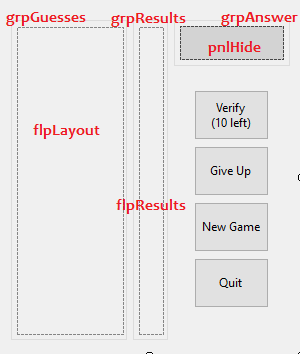

# Mastermind
.NET Core version of 70's board game - Mastermind

## Rules
The game starts with a combination of 4 colors (not necessarily unique) that is hidden and the goal is the correctly guess it within 10 attempts.

Whenever the player verifies his/her guess, a hint status is displayed on the right side showing black and white pins.
- A black pin means that you guessed a color in the right position.
- A white pin means that you guessed the right color but in a different position.

In other words, if you get 4 white pins, you guessed the 4 colors but all in the wrong positions. And if you get 4 black pins, you have won the game!

## Coding it

### Workflow
We are going to have a Menu form that will give the Single player or 2 players options to the user. If the single player is chosen then the game will randomly generate a 4 color combination, otherwise it should enable the user to choose a combination for the other player.

We will also need a main form where the guesses take part. That form will receive in the constructor the 4 color combination, whether it comes from the user input or randomly generated.

There will also be some options in the main form like "Verify combination", "Give up" and "New game".

### Design
There should be 7 different colors to be used in the combination guesses.
For the colored pins we can use rounded panels with background colors and for the black and white ones the same but smaller.

Using a FlowLayoutPanel we will be able to just add the controls and not worry about X and Y positions, so we will use it for adding new combination and result lines of pins.

## Code

### Enum
The first thing that comes to mind is creating an enum for all possible colors
```cs
public enum eColor
{
    White,
    Green,
    Blue,
    Red,
    Yellow,
    Purple,
    Pink
}
```

Let's place it in a file called `Enums.cs` and we should also create a `ColorFromEnum` method where we could easily get a control background color by the enum value.

```cs
public static class Enums
{
    public static Color ColorFromEnum(eColor color)
    {
        switch (color)
        {
            case eColor.White:  return Color.White;
            case eColor.Green:  return Color.Green;
            case eColor.Blue:   return Color.Blue;
            case eColor.Red:    return Color.Red;
            case eColor.Yellow: return Color.Yellow;
            case eColor.Purple: return Color.Purple;
            case eColor.Pink:   return Color.Pink;
            default: throw new ArgumentException("Invalid color code.", nameof(color));
        }
    }
}
```
### Rounded Panel
Next we create a custom class for our rounded panel. There are plenty examples out there of how to do so, I chose a simple one that draws an arc in the corners of the panel, and I adapted it so the panels are always a perfect circle.

```cs
public class CirclePanel : Panel
{
    protected override void OnPaint(PaintEventArgs e)
    {
        base.OnPaint(e);
        ExtendedDraw(e);
        DrawBorder(e.Graphics);
    }

    private Rectangle GetLeftUpper(int e)
        => new Rectangle(0, 0, e, e);

    private Rectangle GetRightUpper(int e)
        => new Rectangle(Width - e, 0, e, e);

    private Rectangle GetRightLower(int e)
        => new Rectangle(Width - e, Height - e, e, e);

    private Rectangle GetLeftLower(int e)
        => new Rectangle(0, Height - e, e, e);

    private void ExtendedDraw(PaintEventArgs e)
    {
        e.Graphics.SmoothingMode = SmoothingMode.HighQuality;
        GraphicsPath path = new GraphicsPath();
        path.StartFigure();
        path.AddArc(GetLeftUpper(Width), 180, 90);
        path.AddLine(Width, 0, 0, 0);
        path.AddArc(GetRightUpper(Width), 270, 90);
        path.AddLine(Width, Width, Width, Height - Width);
        path.AddArc(GetRightLower(Width), 0, 90);
        path.AddLine(0, Height, Width, Height);
        path.AddArc(GetLeftLower(Width), 90, 90);
        path.AddLine(0, Height - Width, 0, Width);
        path.CloseFigure();
        Region = new Region(path);
    }

    private void DrawSingleBorder(Graphics graphics)
    {
        var pen = new Pen(Color.Transparent, 2.0F);
        graphics.DrawArc(pen, new Rectangle(0, 0, Width, Width), 180, 90);
        graphics.DrawArc(pen, new Rectangle(-1, -1, Width, Width), 270, 90);
        graphics.DrawArc(pen, new Rectangle(-1, Height - Width - 1, Width, Width), 0, 90);
        graphics.DrawArc(pen, new Rectangle(0, Height - Width - 1, Width, Width), 90, 90);
        graphics.DrawRectangle(pen, 0.0F, 0.0F, Convert.ToSingle((Width - 1)), Convert.ToSingle((Height - 1)));
    }

    private void DrawBorder(Graphics graphics)
        => DrawSingleBorder(graphics);
}
```

And now, we can add a `CurrentColor` property that will be very useful to us
```cs
private eColor currentColor;

public eColor CurrentColor
{
    get => currentColor;
    set
    {
        currentColor = value;
        this.BackColor = Enums.ColorFromEnum(currentColor);
    }
}
```
Notice that whenever you set the property to a enum value, automatically the panel's background color is also set.

In addition to that, we wish to change the panel color when it gets clicked (or double-clicked), so it can iterate over the enum colors. Let's create a `Panel_Click` method for that.

```cs
private void Panel_Click(object sender, EventArgs e)
{
    var cp = (CirclePanel)sender;

    //the next color after pink, is the first color
    if (cp.CurrentColor == eColor.Pink)
        cp.CurrentColor = 0;
    else
        cp.CurrentColor++;
}
```
We can now do some initial setting in the class constructor, so the events are assigned and we initiate with the enum's first color.
```cs
public CirclePanel()
{
    this.CurrentColor = 0;
    this.Click += Panel_Click;
    this.DoubleClick += Panel_Click;
}
```
For last, we also want to create something that will prevent the color change of the panel.
- Because the black and white pins don't change colors.
- And because we don't want the user to be able to change an already verified combination.

We can achieve that by creating a property named `AllowColorChange` 
```cs
public bool AllowColorChange { get; set; } = true;
```
and modifying the `Panel_Click` method by inserting this `if` in its first line
```cs
if (!this.AllowColorChange)
    return;
```

### Main form
For better understanding, this is the looks of the form



As I said before, this form will receive in the constructor the 4 color combination that is the answer to the puzzle. And we will add it in the `grpAnswer` groupbox, behind the `pnlHide` panel.
Once the game ends, either by winning or losing it, `pnlHide` is removed and the correct answer revealed.

We can start by creating some useful fields in this form
```cs
private int remainingChances = 10;
private readonly List<CirclePanel> currentColors = new List<CirclePanel>();
private readonly List<eColor> answer = new List<eColor>();
```
- `remainingChances` will be used to keep track of when the game needs to end.
- `currentColors` will keep track of the combination that the user just inserted.
- `answer` will save the enum values for the answer, in the correct order.

Now, whenever `btnVerify` is pressed we want a new row of guesses to be added to flpLayout. Let's do that by creating a method that
- Disable all pins in `currentColors` list, so the user can't change its color again.
- Insert new `CirclePanel`s in the list and in the UI.
- Insert a separation line for better looks.
```cs
private void AddNewRow()
{
    foreach (var pin in currentColors)
        pin.AllowColorChange = false;

    currentColors.Clear();
    for (int i = 0; i < 4; i++)
    {
        var coloredPin = new CirclePanel { Size = new Size(20, 20) };
        flpLayout.Controls.Add(coloredPin);
        currentColors.Add(coloredPin);
    }

    //Adds a separation line made with a simple Panel
    flpLayout.Controls.Add(GetNewLine(flpLayout.Width - 5));
}

private Panel GetNewLine(int width)
{
    return new Panel
    {
        BackColor = Color.LightGray,
        Size = new Size(width, 1),
        Margin = new Padding(2, 2, 2, 2),
    };
}
```
Following the same logic, we also want a new result row, but this will be a little more sophisticated, because we need the number of black and white pins. We first add the black pins (if any) and after the white pins. Transparent pins will help us keep the space in case less than 4 pins were inserted.

```cs
private void AddNewResultPin(Color color)
{
    var pin = new CirclePanel
    {
        Size = new Size(10, 10),
        Margin = new Padding(1, 2, 1, 1),
        BackColor = color,
        AllowColorChange = false
    };
    flpResults.Controls.Add(pin);
}

private void AddNewResultRow(int blackPins, int whitePins)
{
    if (blackPins + whitePins > 4)
        throw new Exception("Sum of white and black pins should be at most 4.");

    int count = 0;

    //add all black pins
    while (count < blackPins)
    {
        AddNewResultPin(Color.Black);
        count++;
    }

    //add all white pins
    while (count < whitePins + blackPins)
    {
        AddNewResultPin(Color.White);
        count++;
    }

    //add remaining transparent pins
    while (count < 4)
    {
        AddNewResultPin(Color.Transparent);
        count++;
    }

    flpResults.Controls.Add(GetNewLine(flpResults.Width - 5));
}
```
Now the **core** logic of this game, the determination of how many black and white pins a guess gets.

First we compare our `currentColors` panel list with the actual `answer` to find all black pins. We need a `remainingColors` list here, because the white pin can't be referenced to a color that already got a black pin. So if the current position, that is not one already used by a black pin (`array[i] == 0`), is the same as any remaining color (no matter which position), we add a white pin and remove that color from the list.

```cs
private (int, int) GetResults()
{
    int[] array = new int[] { 0, 0, 0, 0 };
    List<eColor> remainingColors = new List<eColor>();
    (int blacks, int whites) result = (0, 0);
    
    //set all black pins
    for (int i = 0; i < 4; i++)
    {
        if (currentColors[i].CurrentColor == answer[i])
        {
            array[i] = 1;
            result.blacks++;
        }
        else
            remainingColors.Add(answer[i]);
    }

    //set all white pins (a white can't be compared to a position that is already black)
    for (int i = 0; i < 4; i++)
    {
        var color = currentColors[i].CurrentColor;

        //If it's not set yet, search for other positions with the same color
        if (array[i] == 0)
        {
            int index = remainingColors.IndexOf(color);

            //Found color in different position
            if (index >= 0)
            {
                remainingColors.RemoveAt(index);
                result.whites++;
            }
        }
    }
    return result;
}
```
Now we can code our `btnVerify_Click`

```cs
private void btnVerify_Click(object sender, EventArgs e)
{
    remainingChances--;
    btnVerify.Text = $"Verify{Environment.NewLine}({remainingChances} left)";
    var (blackPins, whitePins) = GetResults();
    AddNewResultRow(blackPins, whitePins);

    //Is the game finished?
    if (remainingChances == 0 || blackPins == 4)
        pnlHide.Visible = btnVerify.Enabled = false;
    else
        AddNewRow();
}
```

For last we can initialize what we need in the constructor
```cs
public frmMain(eColor color1, eColor color2, eColor color3, eColor color4)
{
    InitializeComponent();

    //Starts with a new guessing row
    AddNewRow();
    answer.AddRange(new[] { color1, color2, color3, color4 });

    var answerControls = new[] {
        new CirclePanel { Size = new Size(20, 20), Location = new Point(15,20), CurrentColor = answer[0] },
        new CirclePanel { Size = new Size(20, 20), Location = new Point(38,20), CurrentColor = answer[1] },
        new CirclePanel { Size = new Size(20, 20), Location = new Point(61,20), CurrentColor = answer[2] },
        new CirclePanel { Size = new Size(20, 20), Location = new Point(84,20), CurrentColor = answer[3] }
    };

    grpAnswer.Controls.AddRange(answerControls);
}
```